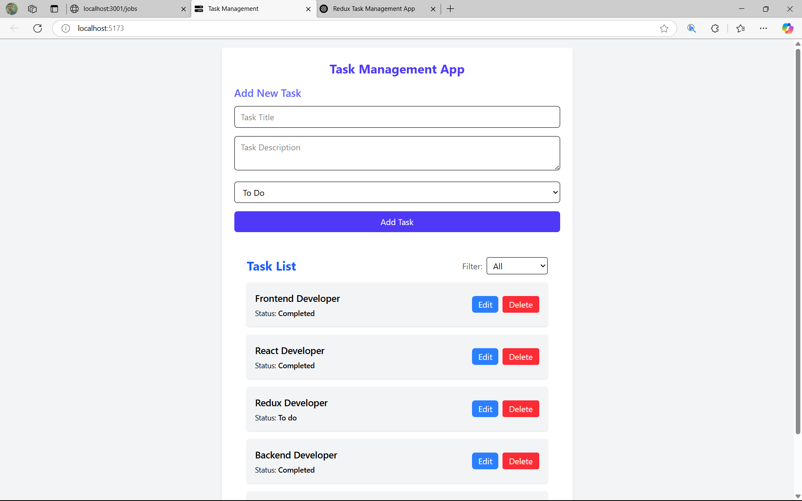

# 📝 Task Management App

A simple and efficient Task Management Tracker built using **React** and **Redux**. This app helps users manage their tasks with ease—add, edit, mark as completed, or delete tasks. It's ideal for individuals or teams looking to stay organized and boost productivity.

## 🔗 Live Demo

👉 [Click here to view the app](https://task-management-tracker.onrender.com/))

## 📸 Screenshots

> ## 📸 Screenshots

### 🧩 Task List View


---

## 🚀 Features

- ✅ Add new tasks  
- ✏️ Edit existing tasks  
- 📌 Mark tasks as complete or incomplete  
- 🗑️ Delete tasks  
- 🧠 State management with **Redux Toolkit**  
- 🧩 Component-based UI using **React**  
- 🎨 Responsive & minimal UI with **Tailwind CSS**

---

## 🛠️ Tech Stack

- **React**
- **Redux Toolkit**
- **JavaScript (ES6+)**
- **Tailwind CSS**
- **Vite** 

---

## 📂 Folder Structure

task-management-tracker/
├── public/
├── src/
│   ├── components/
│   │   ├── TaskForm.jsx
│   │   ├── TaskList.jsx
│   ├── redux/
│   │   └── taskSlice.js
│   ├── App.jsx
│   ├── main.jsx
├── package.json
└── tailwind.config.js

---

## ⚙️ Installation and Setup

```bash
# Clone the repo
git clone https://github.com/your-username/task-management-app.git

# Navigate into the directory
cd task-management-tracker

# Install dependencies
npm install

# Start the development server
npm run dev

🧪 Future Enhancements:-
1. Task search and filtering
2. Due date reminders
3. User login & authentication
4. Backend integration for persistent data

🙌 Contributing:-
Pull requests are welcome! For major changes, please open an issue first to discuss what you'd like to change.

📄 License:-
This project is open-source and available under the MIT License.

👨‍💻 Author
Sagar Satyarthi Mishra
📧 sagarsatyarthimishra@gmail.com
🔗 LinkedIn (https://www.linkedin.com/in/sagar-satyarthi-mishra-0a1800254/)
